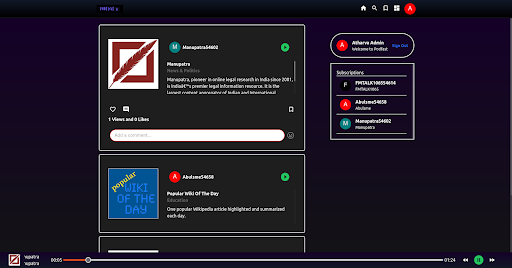
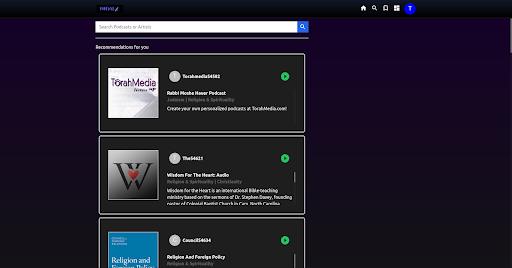
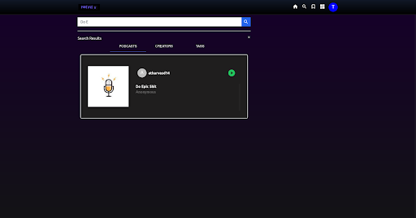
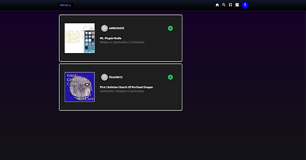
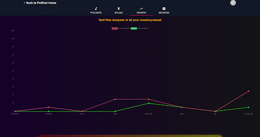
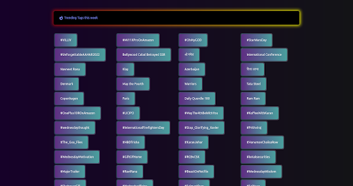
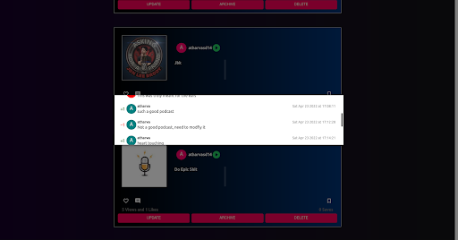
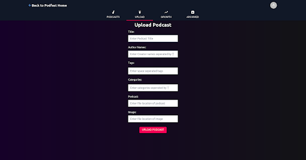
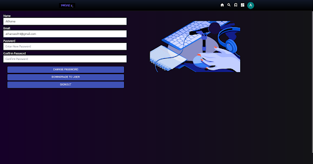

# PodFast: Spotifying the world of Podcast to PodFast

### Features:

1. Audio Summarization
2. Recommendation System
3. Sentiment Analysis
4. Trending Tags
5. Growth Analysis
6. Social media features such as: Like, Comment, Save and subscribe

### Tech Stack:

1. Frontend: NextJS, Tailwind-CSS
2. Backend: Django
3. Database: MongoDB, Google Cloud Storage
4. API: Twitter API

### Screenshots:

1. Feed:

    

2. Recommendations:

    

3. Search

    

4. Saved

    

5. Growth

    

6. Trending

    

7. Sentiment Analysis on Comments

    

8. Upload and Summarization

    

9. Profile

    
